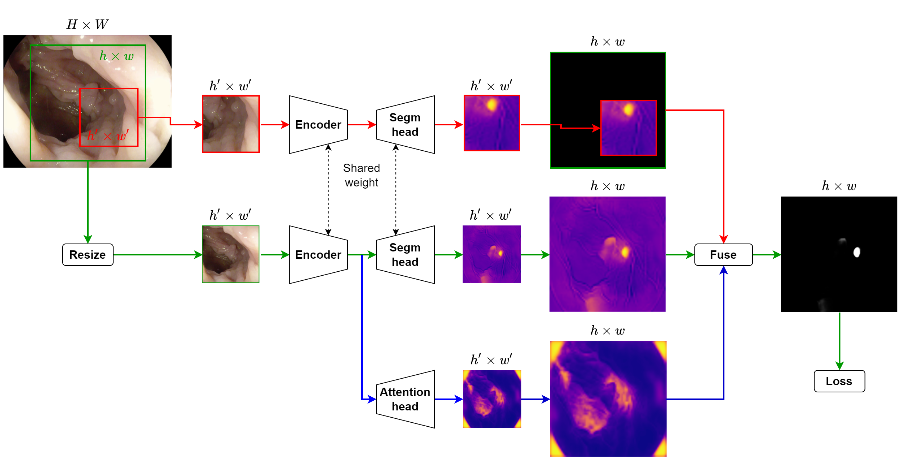
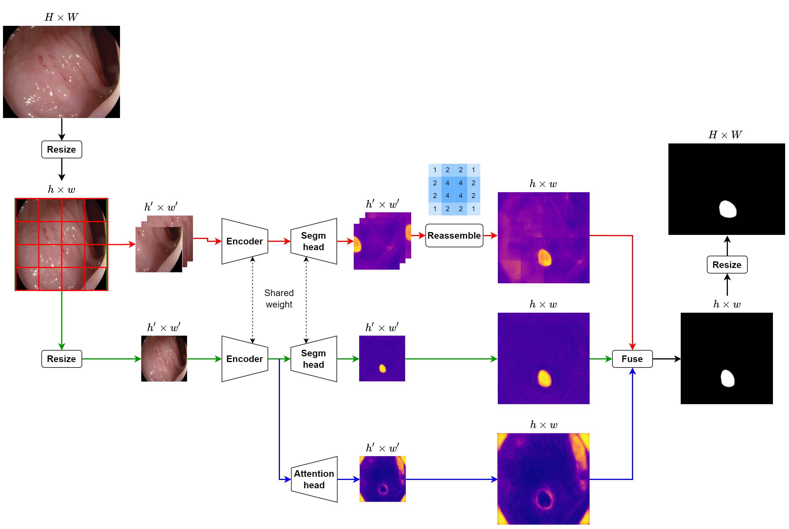

# Polyp Segmentation using Mutiple resolution strategy - HRSeg
In this project, we propose a novel method called HRSeg for polyp segmentation that uses multiple-resolution images to improve the accuracy of polyp segmentation. The proposed method outperforms the state-of-the-art methods for polyp segmentation, achieving higher about 3% accuracy.

## Training strategy


## Inference strategy


## How to

Train

```sh
python train.py
```

Inference

```sh
python inference.py -n HRSeg11 -p model_pth/HRSeg11.e_40.Feb09-11h51.pth
python inference.py -n HRSeg11_2 -p model_pth/HRSeg11_2.e_40.Feb09-13h33.pth
python inference.py -n HRSeg11_3 -p model_pth/HRSeg11_3.e_40.Feb10-06h30.pth
```

Analysis

```sh
python analysis.py -n1 HRSeg11_3 -n2 ssformer_S `
--print_table `
--show_scatter_dice_by_size `
--show_delta_dice `
--show_scatter_dice_by_range_size
```

Visualize

```sh
python visualize.py -n HRSeg11 -p model_pth/HRSeg11.e_40.Feb09-11h51.pth
python visualize.py -n HRSeg11_2 -p model_pth/HRSeg11_2.e_40.Feb09-13h33.pth
python visualize.py -n HRSeg11_3 -p model_pth/HRSeg11_3.e_40.Feb10-06h30.pth
```